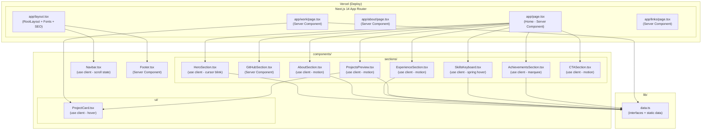
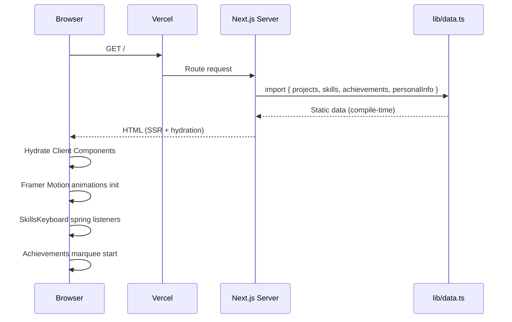
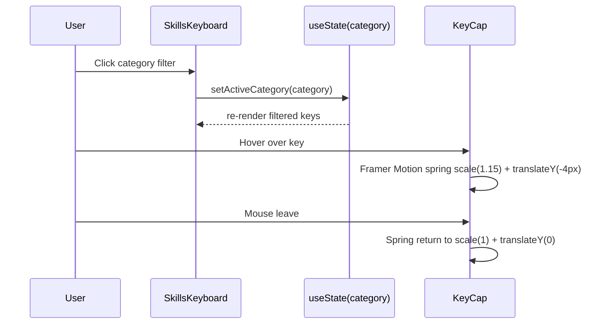
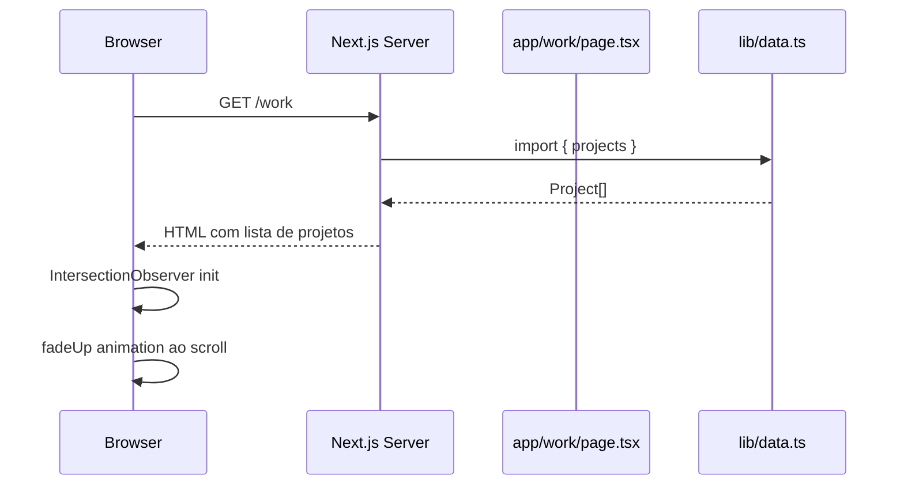

# Design Document: portfolio-web-jeferson

## Overview

Portfolio web profissional para Jeferson Rodrigo (@imnotjef), desenvolvedor Java Backend iniciante de São Paulo buscando primeiro estágio. A aplicação é uma Single-Page Application (SPA) com múltiplas rotas construída em Next.js 14 com App Router, TypeScript strict, Tailwind CSS e Framer Motion. O design segue um tema escuro absoluto com paleta dourada como accent, tipografia refinada (Instrument Serif + DM Sans) e interações ricas como teclado de skills com spring animation e scroll marquee infinito de achievements.

O projeto é deployado na Vercel com Server Components por padrão, `use client` apenas onde há interatividade (animações, hover states, scroll), SEO completo com OpenGraph/Twitter Card e locale pt_BR. Todos os dados estáticos são centralizados em `lib/data.ts` com interfaces TypeScript tipadas.

---

## Architecture



---

## Sequence Diagrams

### Fluxo de Carregamento da Home



### Fluxo de Interação do SkillsKeyboard



### Fluxo de Navegação /work



---

## Components and Interfaces

### Component: Navbar

**Purpose**: Navegação fixa com blur backdrop, links de rota e indicador de página ativa.

**Interface**:
```typescript
// Navbar.tsx — 'use client'
interface NavLink {
  href: string
  label: string
}

const NAV_LINKS: NavLink[] = [
  { href: '/', label: 'Home' },
  { href: '/about', label: 'About' },
  { href: '/work', label: 'Work' },
  { href: '/links', label: 'Links' },
]

export default function Navbar(): JSX.Element
```

**Responsibilities**:
- Renderizar links de navegação com `usePathname()` para active state
- Aplicar `position: fixed`, `backdrop-filter: blur(12px)`, `background: rgba(10,10,10,0.85)`
- Detectar scroll para adicionar border-bottom sutil
- Menu hamburguer em mobile (sm breakpoint)

---

### Component: HeroSection

**Purpose**: Seção de abertura com headline, subtítulo animado com cursor piscando e dois CTAs.

**Interface**:
```typescript
// HeroSection.tsx — 'use client'
interface HeroProps {
  name: string          // "Jeferson Rodrigo"
  role: string          // "Java Backend Developer"
  tagline: string       // subtítulo com cursor
  ctaPrimary: { label: string; href: string }
  ctaSecondary: { label: string; href: string }
}

export default function HeroSection(props: HeroProps): JSX.Element
```

**Responsibilities**:
- Headline em Instrument Serif, tamanho grande (text-5xl md:text-7xl)
- Subtítulo com cursor piscando via `useEffect` + `setInterval`
- Dois botões CTA: primário (accent dourado) e secundário (outline)
- Animação de entrada com `motion.div` variants (fadeUp stagger)
- Background com `hero-bg.png` em `object-cover` com overlay escuro

---

### Component: GitHubSection

**Purpose**: Exibir gráfico de atividade do GitHub via embed externo.

**Interface**:
```typescript
// GitHubSection.tsx — Server Component
interface GitHubSectionProps {
  username: string   // "imnotjef"
  color: string      // "c8b97a"
}

export default function GitHubSection(props: GitHubSectionProps): JSX.Element
```

**Responsibilities**:
- Renderizar ``
- Wrapper com título de seção e padding padrão
- Lazy loading com `loading="lazy"`

---

### Component: SkillsKeyboard

**Purpose**: Teclado Mac interativo com teclas representando skills, filtráveis por categoria.

**Interface**:
```typescript
// SkillsKeyboard.tsx — 'use client'
type SkillCategory = 'Language' | 'Framework' | 'Databases' | 'Tools' | 'Cloud'

interface KeyCapProps {
  skill: Skill
  isActive: boolean
}

interface SkillsKeyboardProps {
  skills: Skill[]
}

export default function SkillsKeyboard(props: SkillsKeyboardProps): JSX.Element
function KeyCap(props: KeyCapProps): JSX.Element
```

**Responsibilities**:
- Renderizar grid de teclas estilo Mac (rows com offset)
- `useState<SkillCategory | 'All'>` para filtro ativo
- Cada `KeyCap` usa `motion.div` com `whileHover={{ scale: 1.15, y: -4 }}` e `transition={{ type: 'spring', stiffness: 400, damping: 17 }}`
- Teclas inativas ficam com `opacity: 0.3`
- Tooltip com nome da skill ao hover

---

### Component: AchievementsSection

**Purpose**: Cards de conquistas com scroll marquee infinito horizontal.

**Interface**:
```typescript
// AchievementsSection.tsx — 'use client'
interface AchievementCardProps {
  achievement: Achievement
}

interface AchievementsSectionProps {
  achievements: Achievement[]
}

export default function AchievementsSection(props: AchievementsSectionProps): JSX.Element
```

**Responsibilities**:
- Duplicar array de achievements para loop contínuo
- Animação CSS `@keyframes marquee` com `animation: marquee 30s linear infinite`
- Pausar ao hover (`animation-play-state: paused`)
- Cards com ícone, título, descrição e data

---

### Component: ProjectCard

**Purpose**: Card de projeto numerado para uso em ProjectsPreview e /work.

**Interface**:
```typescript
// ui/ProjectCard.tsx — 'use client'
interface ProjectCardProps {
  project: Project
  index: number
  variant?: 'preview' | 'full'
}

export default function ProjectCard(props: ProjectCardProps): JSX.Element
```

**Responsibilities**:
- Número grande em Instrument Serif (accent dourado)
- Título com hover dourado (`hover:text-accent`)
- Stack em pills (`bg-surface border border-border rounded-full`)
- Links GitHub + status com dot pulsante (verde = ativo, amarelo = WIP)
- `variant="full"` adiciona categoria em caps e data alinhada à direita
- `motion.div` com `initial={{ opacity: 0, y: 20 }}` + IntersectionObserver

---

## Data Models

### Interface: Project

```typescript
// lib/data.ts
interface Project {
  id: string                          // slug único
  number: number                      // 01, 02, 03...
  title: string
  category: string                    // "Backend" | "API" | "Automation" | etc.
  description: string
  longDescription?: string
  stack: string[]                     // ["Java", "Spring Boot", "PostgreSQL"]
  githubUrl?: string
  liveUrl?: string
  status: 'active' | 'wip' | 'archived'
  badge?: string                      // "Featured" | "Open Source" | etc.
  date: string                        // "2024-01" formato
  featured: boolean                   // aparece em ProjectsPreview
}
```

**Validation Rules**:
- `id` deve ser kebab-case único
- `number` deve ser sequencial e único
- `stack` deve ter ao menos 1 item
- `status` restrito ao union type
- `featured` máximo 3 projetos com `true`

---

### Interface: Skill

```typescript
interface Skill {
  name: string                        // "Java", "Spring Boot"
  category: SkillCategory             // 'Language' | 'Framework' | 'Databases' | 'Tools' | 'Cloud'
  icon?: string                       // emoji ou path de ícone
  level?: 'beginner' | 'intermediate' | 'advanced'
  keyRow?: 0 | 1 | 2 | 3 | 4         // linha no teclado (0 = número, 4 = espaço)
}

type SkillCategory = 'Language' | 'Framework' | 'Databases' | 'Tools' | 'Cloud'
```

---

### Interface: Achievement

```typescript
interface Achievement {
  id: string
  title: string
  description: string
  icon: string                        // emoji
  date: string                        // "2024-03"
  link?: string
  category: 'community' | 'education' | 'certification' | 'project'
}
```

---

### Interface: PersonalInfo

```typescript
interface PersonalInfo {
  name: string                        // "Jeferson Rodrigo"
  handle: string                      // "@imnotjef"
  role: string                        // "Java Backend Developer"
  location: string                    // "São Paulo, Brasil"
  bio: string
  email?: string
  github: string                      // "https://github.com/imnotjef"
  linkedin?: string
  twitter?: string
  availableForWork: boolean
  metrics: {
    label: string
    value: string
  }[]                                 // grid 3 colunas na AboutSection
}
```

---

### Dados Estáticos (lib/data.ts)

```typescript
export const personalInfo: PersonalInfo = {
  name: "Jeferson Rodrigo",
  handle: "@imnotjef",
  role: "Java Backend Developer",
  location: "São Paulo, Brasil",
  bio: "Desenvolvedor Java Backend iniciante apaixonado por construir sistemas robustos e escaláveis. Buscando primeiro estágio para aplicar conhecimentos em Spring Boot, PostgreSQL e boas práticas de engenharia de software.",
  github: "https://github.com/imnotjef",
  availableForWork: true,
  metrics: [
    { label: "Projetos", value: "5+" },
    { label: "Commits", value: "200+" },
    { label: "Tecnologias", value: "15+" },
  ],
}

export const projects: Project[] = [
  {
    id: "sistema-bancario",
    number: 1,
    title: "Sistema Bancário",
    category: "Backend",
    description: "Sistema bancário completo com operações de conta, transferências e extrato.",
    stack: ["Java", "Spring Boot", "PostgreSQL", "Docker"],
    status: "active",
    date: "2024-01",
    featured: true,
    badge: "Featured",
  },
  {
    id: "portfolio-api",
    number: 2,
    title: "Portfolio API",
    category: "API",
    description: "API REST para gerenciamento de dados do portfolio com autenticação JWT.",
    stack: ["Java", "Spring Boot", "Spring Security", "PostgreSQL"],
    status: "active",
    date: "2024-02",
    featured: true,
  },
  {
    id: "youtube-shorts-automator",
    number: 3,
    title: "YouTube Shorts Automator",
    category: "Automation",
    description: "Automação para criação e upload de YouTube Shorts com geração de conteúdo.",
    stack: ["Python", "YouTube API", "FFmpeg"],
    status: "wip",
    date: "2024-03",
    featured: true,
    badge: "WIP",
  },
  {
    id: "sampatech-hub",
    number: 4,
    title: "sampatech-hub",
    category: "Community",
    description: "Hub da comunidade SampaTech para desenvolvedores de São Paulo.",
    stack: ["Next.js", "TypeScript", "Tailwind CSS"],
    status: "active",
    date: "2023-11",
    featured: false,
    badge: "Open Source",
  },
  {
    id: "github-readme",
    number: 5,
    title: "GitHub README",
    category: "Profile",
    description: "README de perfil GitHub com estatísticas dinâmicas e design customizado.",
    stack: ["Markdown", "GitHub Actions", "SVG"],
    status: "active",
    date: "2023-09",
    featured: false,
  },
]

export const skills: Skill[] = [
  // Languages
  { name: "Java", category: "Language", icon: "☕", level: "intermediate", keyRow: 1 },
  { name: "TypeScript", category: "Language", icon: "🔷", level: "beginner", keyRow: 1 },
  { name: "Python", category: "Language", icon: "🐍", level: "beginner", keyRow: 1 },
  { name: "SQL", category: "Language", icon: "🗄️", level: "intermediate", keyRow: 2 },
  // Frameworks
  { name: "Spring Boot", category: "Framework", icon: "🍃", level: "intermediate", keyRow: 2 },
  { name: "Spring Security", category: "Framework", icon: "🔒", level: "beginner", keyRow: 2 },
  { name: "Next.js", category: "Framework", icon: "▲", level: "beginner", keyRow: 3 },
  // Databases
  { name: "PostgreSQL", category: "Databases", icon: "🐘", level: "intermediate", keyRow: 3 },
  { name: "MySQL", category: "Databases", icon: "🐬", level: "beginner", keyRow: 3 },
  // Tools
  { name: "Git", category: "Tools", icon: "🌿", level: "intermediate", keyRow: 4 },
  { name: "Docker", category: "Tools", icon: "🐳", level: "beginner", keyRow: 4 },
  { name: "Maven", category: "Tools", icon: "📦", level: "intermediate", keyRow: 4 },
  { name: "IntelliJ", category: "Tools", icon: "🧠", level: "intermediate", keyRow: 0 },
  // Cloud
  { name: "AWS", category: "Cloud", icon: "☁️", level: "beginner", keyRow: 0 },
  { name: "Vercel", category: "Cloud", icon: "▲", level: "beginner", keyRow: 0 },
]

export const achievements: Achievement[] = [
  {
    id: "sampatech-hub",
    title: "sampatech-hub",
    description: "Contribuidor ativo da comunidade de devs de São Paulo",
    icon: "🏙️",
    date: "2023-11",
    category: "community",
  },
  {
    id: "plano-32-semanas",
    title: "Plano 32 Semanas",
    description: "Completou plano intensivo de estudos de backend",
    icon: "📅",
    date: "2024-01",
    category: "education",
  },
  {
    id: "fatec-sao-roque",
    title: "FATEC São Roque",
    description: "Cursando Análise e Desenvolvimento de Sistemas",
    icon: "🎓",
    date: "2023-02",
    category: "education",
  },
  {
    id: "aws-clf-c02",
    title: "AWS CLF-C02",
    description: "AWS Certified Cloud Practitioner",
    icon: "☁️",
    date: "2024-04",
    category: "certification",
  },
  {
    id: "github-foundations",
    title: "GitHub Foundations",
    description: "GitHub Foundations Certification",
    icon: "🐙",
    date: "2024-03",
    category: "certification",
  },
]
```

---

## Algorithmic Pseudocode

### Algoritmo: Cursor Piscando (HeroSection)

```typescript
// Preconditions:
//   - Component is mounted (useEffect ran)
//   - cursorVisible: boolean state initialized as true
// Postconditions:
//   - cursor alternates visibility every 530ms
//   - interval is cleared on unmount (no memory leak)
// Loop Invariants:
//   - interval ID is always valid while component is mounted

function useCursorBlink(): boolean {
  const [cursorVisible, setCursorVisible] = useState<boolean>(true)

  useEffect(() => {
    const interval = setInterval(() => {
      setCursorVisible(prev => !prev)
    }, 530)

    return () => clearInterval(interval)  // cleanup
  }, [])

  return cursorVisible
}
```

---

### Algoritmo: Filtro de Skills por Categoria (SkillsKeyboard)

```typescript
// Preconditions:
//   - skills: Skill[] is non-empty
//   - activeCategory: SkillCategory | 'All' is initialized as 'All'
// Postconditions:
//   - filteredSkills contains only skills matching activeCategory
//   - if activeCategory === 'All', filteredSkills === skills
// Loop Invariants:
//   - every item in filteredSkills satisfies the category predicate

function useSkillFilter(skills: Skill[]) {
  const [activeCategory, setActiveCategory] = useState<SkillCategory | 'All'>('All')

  const filteredSkills = useMemo<Skill[]>(() => {
    if (activeCategory === 'All') return skills
    return skills.filter(skill => skill.category === activeCategory)
  }, [skills, activeCategory])

  return { filteredSkills, activeCategory, setActiveCategory }
}
```

---

### Algoritmo: Scroll Marquee Infinito (AchievementsSection)

```typescript
// Preconditions:
//   - achievements: Achievement[] has at least 1 item
// Postconditions:
//   - doubled array enables seamless CSS loop
//   - animation pauses on hover via CSS animation-play-state
// Note: Pure CSS animation — no JS loop needed

function useMarqueeItems<T>(items: T[]): T[] {
  // Double the array so the marquee loops seamlessly
  // Precondition: items.length >= 1
  // Postcondition: result.length === items.length * 2
  return useMemo(() => [...items, ...items], [items])
}

// CSS animation (in tailwind.config.ts):
// @keyframes marquee {
//   0%   { transform: translateX(0) }
//   100% { transform: translateX(-50%) }
// }
// animation: marquee 30s linear infinite
// &:hover { animation-play-state: paused }
```

---

### Algoritmo: fadeUp com IntersectionObserver (ProjectCard / Work page)

```typescript
// Preconditions:
//   - ref is attached to a DOM element
//   - threshold: 0.1 (10% visible triggers animation)
// Postconditions:
//   - element animates from { opacity: 0, y: 20 } to { opacity: 1, y: 0 }
//   - animation fires once (unobserve after trigger)

const fadeUpVariants: Variants = {
  hidden: { opacity: 0, y: 20 },
  visible: {
    opacity: 1,
    y: 0,
    transition: { duration: 0.5, ease: [0.25, 0.46, 0.45, 0.94] },
  },
}

function FadeUpWrapper({ children, delay = 0 }: {
  children: React.ReactNode
  delay?: number
}): JSX.Element {
  return (
    <motion.div
      initial="hidden"
      whileInView="visible"
      viewport={{ once: true, amount: 0.1 }}
      variants={fadeUpVariants}
      transition={{ delay }}
    >
      {children}
    </motion.div>
  )
}
```

---

### Algoritmo: Stagger de Animações na Home

```typescript
// Preconditions:
//   - containerVariants define staggerChildren
//   - itemVariants define individual animation
// Postconditions:
//   - children animate sequentially with staggerChildren delay
//   - animation triggers once when container enters viewport

const containerVariants: Variants = {
  hidden: {},
  visible: {
    transition: {
      staggerChildren: 0.12,
      delayChildren: 0.2,
    },
  },
}

const itemVariants: Variants = {
  hidden: { opacity: 0, y: 24 },
  visible: {
    opacity: 1,
    y: 0,
    transition: { duration: 0.6, ease: 'easeOut' },
  },
}
```

---

## Key Functions with Formal Specifications

### app/layout.tsx — RootLayout

```typescript
// Preconditions:
//   - fonts loaded via next/font/google (Instrument_Serif, DM_Sans)
//   - metadata object is complete with OG and Twitter Card
// Postconditions:
//   - <html> has lang="pt-BR"
//   - CSS variables --font-heading, --font-body applied to <body>
//   - Navbar and Footer rendered around {children}

export const metadata: Metadata = {
  title: 'Jeferson Rodrigo | Java Backend Developer',
  description: 'Desenvolvedor Java Backend iniciante buscando primeiro estágio. Spring Boot, PostgreSQL, Git. São Paulo, Brasil.',
  openGraph: {
    title: 'Jeferson Rodrigo | Java Backend Developer',
    description: '...',
    locale: 'pt_BR',
    type: 'website',
  },
  twitter: {
    card: 'summary_large_image',
    title: 'Jeferson Rodrigo | Java Backend Developer',
  },
}

export default function RootLayout({
  children,
}: {
  children: React.ReactNode
}): JSX.Element
```

---

### app/page.tsx — Home

```typescript
// Preconditions:
//   - All section components exist and are importable
//   - lib/data.ts exports are valid
// Postconditions:
//   - Renders sections in order: Hero, GitHub, About, Experience,
//     ProjectsPreview, SkillsKeyboard, Achievements, CTA
//   - Server Component (no 'use client')

export default function HomePage(): JSX.Element {
  const featuredProjects = projects.filter(p => p.featured)
  // Precondition: featuredProjects.length === 3
  return (
    <main>
      <HeroSection {...heroProps} />
      <GitHubSection username="imnotjef" color="c8b97a" />
      <AboutSection personalInfo={personalInfo} />
      <ExperienceSection />
      <ProjectsPreview projects={featuredProjects} />
      <SkillsKeyboard skills={skills} />
      <AchievementsSection achievements={achievements} />
      <CTASection />
    </main>
  )
}
```

---

### app/work/page.tsx — Work

```typescript
// Preconditions:
//   - projects array is sorted by number ascending
//   - ProjectCard component accepts variant="full"
// Postconditions:
//   - All projects rendered with fadeUp animation
//   - Each project has: number, category, title, date, stack, links, status

export default function WorkPage(): JSX.Element {
  const sortedProjects = [...projects].sort((a, b) => a.number - b.number)
  // Postcondition: sortedProjects[i].number < sortedProjects[i+1].number for all i

  return (
    <main>
      <section>
        <h1>Work</h1>
        <div>
          {sortedProjects.map((project, index) => (
            <FadeUpWrapper key={project.id} delay={index * 0.08}>
              <ProjectCard project={project} index={index} variant="full" />
            </FadeUpWrapper>
          ))}
        </div>
      </section>
    </main>
  )
}
```

---

### tailwind.config.ts — Design Tokens

```typescript
// Preconditions:
//   - tailwindcss installed
//   - @tailwindcss/typography optional
// Postconditions:
//   - All design tokens available as Tailwind classes
//   - Custom animations: marquee, pulse-dot, cursor-blink
//   - Font families: heading (Instrument Serif), body (DM Sans), mono (JetBrains Mono)

import type { Config } from 'tailwindcss'

const config: Config = {
  content: ['./app/**/*.{ts,tsx}', './components/**/*.{ts,tsx}'],
  theme: {
    extend: {
      colors: {
        bg: '#0a0a0a',
        surface: '#111111',
        border: 'rgba(255,255,255,0.08)',
        'border-hover': 'rgba(255,255,255,0.18)',
        'text-primary': '#f0ede8',
        'text-secondary': '#888880',
        'text-muted': '#444440',
        accent: '#c8b97a',
      },
      fontFamily: {
        heading: ['var(--font-heading)', 'serif'],
        body: ['var(--font-body)', 'sans-serif'],
        mono: ['JetBrains Mono', 'monospace'],
      },
      keyframes: {
        marquee: {
          '0%': { transform: 'translateX(0)' },
          '100%': { transform: 'translateX(-50%)' },
        },
        'pulse-dot': {
          '0%, 100%': { opacity: '1' },
          '50%': { opacity: '0.3' },
        },
        'cursor-blink': {
          '0%, 100%': { opacity: '1' },
          '50%': { opacity: '0' },
        },
      },
      animation: {
        marquee: 'marquee 30s linear infinite',
        'pulse-dot': 'pulse-dot 2s ease-in-out infinite',
        'cursor-blink': 'cursor-blink 1.06s step-end infinite',
      },
      maxWidth: {
        content: '1100px',
      },
    },
  },
  plugins: [],
}

export default config
```

---

### next.config.ts

```typescript
// Preconditions:
//   - next installed
//   - ghchart.rshah.org needs to be in remotePatterns for next/image (if used)
// Postconditions:
//   - TypeScript strict mode enforced
//   - Images from ghchart.rshah.org allowed

import type { NextConfig } from 'next'

const nextConfig: NextConfig = {
  images: {
    remotePatterns: [
      {
        protocol: 'https',
        hostname: 'ghchart.rshah.org',
      },
    ],
  },
}

export default nextConfig
```

---

### tsconfig.json

```typescript
// Preconditions: TypeScript installed
// Postconditions:
//   - strict: true (no implicit any, strict null checks)
//   - paths alias @/* → ./*
//   - target ES2017+ for async/await support

{
  "compilerOptions": {
    "target": "ES2017",
    "lib": ["dom", "dom.iterable", "esnext"],
    "allowJs": true,
    "skipLibCheck": true,
    "strict": true,
    "noEmit": true,
    "esModuleInterop": true,
    "module": "esnext",
    "moduleResolution": "bundler",
    "resolveJsonModule": true,
    "isolatedModules": true,
    "jsx": "preserve",
    "incremental": true,
    "plugins": [{ "name": "next" }],
    "paths": { "@/*": ["./*"] }
  },
  "include": ["next-env.d.ts", "**/*.ts", "**/*.tsx", ".next/types/**/*.ts"],
  "exclude": ["node_modules"]
}
```

---

## Example Usage

### Renderizando ProjectCard em /work

```typescript
// app/work/page.tsx
import { projects } from '@/lib/data'
import ProjectCard from '@/components/ui/ProjectCard'
import FadeUpWrapper from '@/components/ui/FadeUpWrapper'

export default function WorkPage() {
  const sorted = [...projects].sort((a, b) => a.number - b.number)

  return (
    <main className="max-w-content mx-auto px-10 md:px-[2.5rem] py-24">
      <h1 className="font-heading text-5xl text-text-primary mb-16">Work</h1>
      <div className="flex flex-col divide-y divide-border">
        {sorted.map((project, i) => (
          <FadeUpWrapper key={project.id} delay={i * 0.08}>
            <ProjectCard project={project} index={i} variant="full" />
          </FadeUpWrapper>
        ))}
      </div>
    </main>
  )
}
```

### Renderizando SkillsKeyboard

```typescript
// components/sections/SkillsKeyboard.tsx
'use client'
import { motion } from 'framer-motion'
import { useState, useMemo } from 'react'
import type { Skill, SkillCategory } from '@/lib/data'

const CATEGORIES: Array<SkillCategory | 'All'> = ['All', 'Language', 'Framework', 'Databases', 'Tools', 'Cloud']

export default function SkillsKeyboard({ skills }: { skills: Skill[] }) {
  const [active, setActive] = useState<SkillCategory | 'All'>('All')

  const filtered = useMemo(
    () => active === 'All' ? skills : skills.filter(s => s.category === active),
    [skills, active]
  )

  return (
    <section className="max-w-content mx-auto px-[2.5rem] py-24">
      <h2 className="font-heading text-4xl text-text-primary mb-8">Skills</h2>

      {/* Category filters */}
      <div className="flex gap-2 mb-8 flex-wrap">
        {CATEGORIES.map(cat => (
          <button
            key={cat}
            onClick={() => setActive(cat)}
            className={`px-4 py-1.5 rounded-full text-sm border transition-colors ${
              active === cat
                ? 'border-accent text-accent bg-accent/10'
                : 'border-border text-text-secondary hover:border-border-hover'
            }`}
          >
            {cat}
          </button>
        ))}
      </div>

      {/* Keyboard grid */}
      <div className="flex flex-wrap gap-2">
        {filtered.map(skill => (
          <motion.div
            key={skill.name}
            whileHover={{ scale: 1.15, y: -4 }}
            transition={{ type: 'spring', stiffness: 400, damping: 17 }}
            className="px-4 py-3 bg-surface border border-border rounded-lg cursor-default
                       flex flex-col items-center gap-1 min-w-[72px]"
          >
            <span className="text-xl">{skill.icon}</span>
            <span className="text-xs text-text-secondary font-mono">{skill.name}</span>
          </motion.div>
        ))}
      </div>
    </section>
  )
}
```

### Achievements Marquee

```typescript
// components/sections/AchievementsSection.tsx
'use client'
import { useMemo } from 'react'
import type { Achievement } from '@/lib/data'

export default function AchievementsSection({ achievements }: { achievements: Achievement[] }) {
  const doubled = useMemo(() => [...achievements, ...achievements], [achievements])

  return (
    <section className="py-24 overflow-hidden">
      <h2 className="font-heading text-4xl text-text-primary max-w-content mx-auto px-[2.5rem] mb-12">
        Achievements
      </h2>
      <div className="group flex gap-4 w-max animate-marquee hover:[animation-play-state:paused]">
        {doubled.map((achievement, i) => (
          <div
            key={`${achievement.id}-${i}`}
            className="flex-shrink-0 w-72 p-6 bg-surface border border-border rounded-xl"
          >
            <span className="text-3xl">{achievement.icon}</span>
            <h3 className="font-heading text-lg text-text-primary mt-3">{achievement.title}</h3>
            <p className="text-sm text-text-secondary mt-1">{achievement.description}</p>
            <span className="text-xs text-text-muted mt-3 block font-mono">{achievement.date}</span>
          </div>
        ))}
      </div>
    </section>
  )
}
```

---

## Correctness Properties

*Uma propriedade é uma característica ou comportamento que deve ser verdadeiro em todas as execuções válidas do sistema — essencialmente, uma declaração formal sobre o que o sistema deve fazer. As propriedades servem como ponte entre especificações legíveis por humanos e garantias de corretude verificáveis por máquina.*

### Property 1: Unicidade de números em projetos featured

*Para quaisquer* dois projetos featured distintos, seus números são diferentes.

**Validates: Requirements 5.2, 11.5**

```typescript
// ∀ p1, p2 ∈ projects: p1.featured && p2.featured && p1 ≠ p2 → p1.number ≠ p2.number
const featuredNumbers = projects.filter(p => p.featured).map(p => p.number)
assert(new Set(featuredNumbers).size === featuredNumbers.length)
```

### Property 2: Limite de projetos featured

*Para qualquer* conjunto de projetos, o número de projetos com `featured: true` nunca excede 3.

**Validates: Requirements 5.2, 11.6**

```typescript
// |{ p ∈ projects | p.featured }| ≤ 3
assert(projects.filter(p => p.featured).length <= 3)
```

### Property 3: Categorias de skills são sempre válidas

*Para toda* skill no Data_Layer, ela pertence a uma das categorias do union type `SkillCategory`.

**Validates: Requirements 6.10, 11.7**

```typescript
// ∀ s ∈ skills: s.category ∈ { 'Language', 'Framework', 'Databases', 'Tools', 'Cloud' }
const VALID_CATEGORIES = new Set(['Language', 'Framework', 'Databases', 'Tools', 'Cloud'])
assert(skills.every(s => VALID_CATEGORIES.has(s.category)))
```

### Property 4: Marquee doubled tem exatamente o dobro de itens

*Para qualquer* array de achievements com ao menos 1 item, o array duplicado para o marquee tem exatamente `length * 2` itens.

**Validates: Requirements 7.2, 7.3**

```typescript
// doubled.length === achievements.length * 2
const doubled = [...achievements, ...achievements]
assert(doubled.length === achievements.length * 2)
```

### Property 5: Projetos na Work page estão em ordem crescente

*Para qualquer* array de projetos, após ordenação por `number`, cada projeto tem número estritamente maior que o anterior.

**Validates: Requirements 8.1**

```typescript
// ∀ i ∈ [1, sorted.length): sorted[i-1].number < sorted[i].number
const sorted = [...projects].sort((a, b) => a.number - b.number)
assert(sorted.every((p, i) => i === 0 || sorted[i - 1].number < p.number))
```

### Property 6: Filtro de skills por categoria é um subconjunto válido

*Para qualquer* array de skills e qualquer categoria (incluindo `'All'`), o resultado do filtro é sempre um subconjunto do array original; quando a categoria é `'All'`, o resultado tem o mesmo tamanho do array original; quando é uma categoria específica, todos os itens retornados pertencem àquela categoria.

**Validates: Requirements 6.3, 6.4, 11.7**

```typescript
// activeCategory === 'All' → filteredSkills.length === skills.length
// ∀ category ≠ 'All': filteredSkills ⊆ skills ∧ ∀ s ∈ filteredSkills: s.category === category
const filteredAll = filterSkills(skills, 'All')
assert(filteredAll.length === skills.length)

const filteredLang = filterSkills(skills, 'Language')
assert(filteredLang.every(s => s.category === 'Language'))
assert(filteredLang.length <= skills.length)
```

### Property 7: Stack de projeto tem ao menos 1 item

*Para qualquer* projeto válido no Data_Layer, o array `stack` contém ao menos 1 tecnologia.

**Validates: Requirements 11.3**

```typescript
// ∀ p ∈ projects: p.stack.length >= 1
assert(projects.every(p => p.stack.length >= 1))
```

### Property 8: Links externos têm atributos de segurança

*Para qualquer* link externo renderizado pelo Portfolio, o elemento `<a>` contém `rel="noopener noreferrer"` e `target="_blank"`.

**Validates: Requirements 1.7, 5.8, 10.2**

```typescript
// ∀ link ∈ externalLinks: link.rel.includes('noopener') && link.rel.includes('noreferrer')
// ∀ link ∈ externalLinks: link.target === '_blank'
const externalLinks = document.querySelectorAll('a[href^="http"]')
externalLinks.forEach(link => {
  assert(link.getAttribute('rel')?.includes('noopener noreferrer'))
  assert(link.getAttribute('target') === '_blank')
})
```

---

## Error Handling

### Cenário 1: GitHub Chart indisponível

**Condition**: `ghchart.rshah.org` retorna erro ou timeout  
**Response**: `` renderiza com `alt="GitHub Activity Chart"` — fallback nativo do browser  
**Recovery**: Sem retry automático; usuário vê texto alternativo

### Cenário 2: Imagem de perfil não encontrada

**Condition**: `public/profile-card.jpg` ausente  
**Response**: `next/image` com `placeholder="blur"` e `blurDataURL` base64 inline  
**Recovery**: Placeholder blur exibido até imagem carregar

### Cenário 3: Dados ausentes em lib/data.ts

**Condition**: Array vazio (ex: `projects = []`)  
**Response**: Componentes renderizam estado vazio com mensagem "Em breve"  
**Recovery**: Não aplicável — dados são estáticos em compile-time

### Cenário 4: Framer Motion SSR

**Condition**: `motion.div` em Server Component  
**Response**: TypeScript error em compile-time — `'use client'` obrigatório  
**Recovery**: Todos os componentes com `motion.*` têm `'use client'` no topo

---

## Testing Strategy

### Unit Testing Approach

Usar **Vitest** + **@testing-library/react** para testes de componentes.

Casos de teste prioritários:
- `useCursorBlink`: verifica alternância de estado a cada 530ms
- `useSkillFilter`: verifica filtro por categoria e retorno total com 'All'
- `useMarqueeItems`: verifica que array duplicado tem `length * 2` itens
- `ProjectCard`: renderiza número, título, stack e status corretamente
- `WorkPage`: projetos renderizados em ordem crescente por número

### Property-Based Testing Approach

**Property Test Library**: fast-check

```typescript
import fc from 'fast-check'

// Propriedade: filtro de skills nunca retorna mais itens que o total
fc.assert(
  fc.property(
    fc.array(fc.record({ name: fc.string(), category: fc.constantFrom(...VALID_CATEGORIES) })),
    fc.constantFrom(...VALID_CATEGORIES, 'All'),
    (skills, category) => {
      const filtered = category === 'All' ? skills : skills.filter(s => s.category === category)
      return filtered.length <= skills.length
    }
  )
)

// Propriedade: marquee doubled sempre tem exatamente 2x os itens
fc.assert(
  fc.property(
    fc.array(fc.record({ id: fc.string(), title: fc.string() }), { minLength: 1 }),
    (items) => {
      const doubled = [...items, ...items]
      return doubled.length === items.length * 2
    }
  )
)
```

### Integration Testing Approach

- Testar navegação entre rotas (`/`, `/work`, `/about`, `/links`) com `@testing-library/react` + Next.js test utils
- Verificar que metadata SEO está presente no `<head>` em cada rota
- Verificar que `lang="pt-BR"` está no `<html>`

---

## Performance Considerations

- **Server Components por padrão**: reduz bundle JS enviado ao cliente
- **`use client` mínimo**: apenas componentes com interatividade (Navbar, seções animadas, SkillsKeyboard, AchievementsSection)
- **`next/font`**: fontes carregadas com zero layout shift (font-display: swap automático)
- **`next/image`**: otimização automática de imagens (WebP, lazy loading, tamanhos responsivos)
- **Framer Motion lazy**: `LazyMotion` + `domAnimation` para reduzir bundle de animações
- **CSS Marquee**: animação de achievements via CSS puro (sem JS loop) — zero overhead de JS
- **Static data**: `lib/data.ts` é resolvido em compile-time, sem fetch em runtime

---

## Security Considerations

- **Sem autenticação**: portfolio é 100% público, sem dados sensíveis
- **Links externos**: todos os `<a>` externos usam `target="_blank" rel="noopener noreferrer"`
- **CSP**: Vercel aplica headers de segurança por padrão; `ghchart.rshah.org` deve estar em `img-src` da CSP
- **Sem variáveis de ambiente sensíveis**: nenhuma API key necessária para o portfolio
- **TypeScript strict**: previne erros de tipo em runtime que poderiam causar comportamento inesperado

---

## Dependencies

```json
{
  "dependencies": {
    "next": "14.2.x",
    "react": "18.3.x",
    "react-dom": "18.3.x",
    "framer-motion": "11.x",
    "clsx": "2.x",
    "tailwind-merge": "2.x"
  },
  "devDependencies": {
    "typescript": "5.x",
    "@types/node": "20.x",
    "@types/react": "18.x",
    "@types/react-dom": "18.x",
    "tailwindcss": "3.4.x",
    "postcss": "8.x",
    "autoprefixer": "10.x",
    "vitest": "1.x",
    "@testing-library/react": "15.x",
    "@testing-library/jest-dom": "6.x",
    "fast-check": "3.x"
  }
}
```

**Fontes (via next/font/google)**:
- `Instrument_Serif` — headings
- `DM_Sans` — body text
- `JetBrains_Mono` — código e labels técnicos (via CSS import ou next/font)

**Serviços externos**:
- `ghchart.rshah.org` — GitHub activity chart embed
- `Vercel` — deploy e CDN
